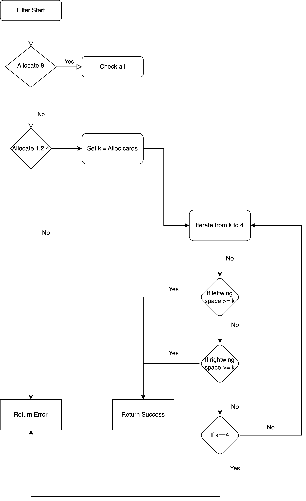

## Background

When multiple XPUs are configured on a single P800 server, the GPU cards have better performance to be connected or on the same numa, as the following figure shows. This forms a topology among all the cards on the server. 


A user job requests a certain number of kunlunxin.com/xpu resources, Kubernetes schedule pods to the appropriate node with minimized fragmentation, and quality of performance. Xpu-device further processes the logic of allocating the remaining resources on the resource node following criterias below:
1. Only 1,2,4,8 cards allocations are legal

2. Allocation of 1,2,4 XPUs can't be assigned across different numas.

3. Minimize the fragmentation after alloation.

## Filter

In filter we need to find all nodes available to the allocating task. Beyond that, we need to pick the best XPU combination plan for this node and store the result for `score` process to use. The best XPU combination plan is selected as the following figure shows.



## Score

In Score we need to compare between multiple filtered nodes, and score every one of them, pick the best one to fit. In order to do that, we introduce a concept called 'MTF'(minimized tasks to fill). For example, The following table shows the occupation of XPU and corresponding MTF

| XPU occupation | MTF | Description |
|-------|-------|-------|
| 11111111 | 0 | Already full, can't submit any task |
| 00000000 | 1 | A 8 xpu task can fill it |
| 00000011 | 2 | A 4 xpu task and a 2 xpu task can fill it |
| 00000001 | 3 | A 4 xpu task, 2 xpu task and 1 xpu task can fill it |
| 00010001 | 4 | Two 2 xpu tasks and two 1 xpu tasks can fill it|

The Node score is concluded by comparing delta(MTF), which means the change of MTF value after allocation, the less delta(MTF) is, the higher score, as the following table shows

| delta(MTF) | Score | Example |
|------------|-------|---------|
|   -1       | 2000  | 00000111->00001111 |
|    0       | 1000  | 00000111->00110111 |
|    1       | 0     | 00001111->00011111 |
|    2       | -1000 | 00000000->00000001 |

## Bind

In Bind we simply need to patch the result of allocation to pod annotations,for example

```
BAIDU_COM_DEVICE_IDX=0,1,2,3
```
