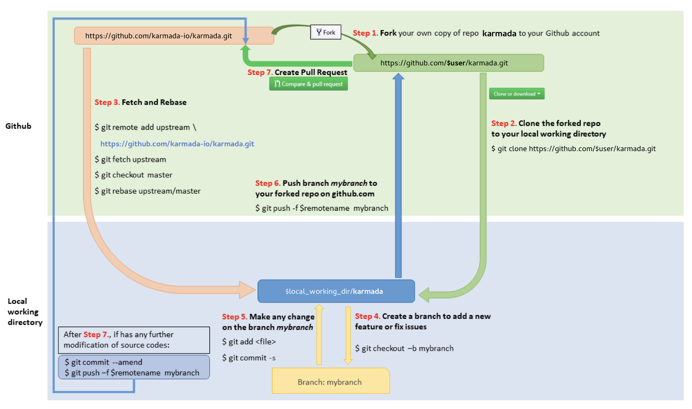

> 本文档摘自 [Kubernetes github-workflow](https://github.com/kubernetes/community/blob/master/contributors/guide/github-workflow.md)。



## 在云端创建 Fork

1. 访问 https://github.com/Project-HAMi/HAMi
2. 点击 `Fork` 按钮（右上角）以建立基于云的 fork。

## 克隆 fork 到本地存储

根据 Go 的 [工作区说明][go-workspace]，使用以下克隆步骤将 HAMi 的代码放置在你的 `GOPATH` 中。

[go-workspace]: https://golang.org/doc/code.html#Workspaces

定义一个本地工作目录：

```sh
# 如果你的 GOPATH 有多个路径，选择一个并在此处使用它而不是 $GOPATH。
# 你必须严格遵循此模式，
# 既不能是 `$GOPATH/src/github.com/${your github profile name/`
# 也不能是其他任何模式。
export working_dir="$(go env GOPATH)/src/github.com/Project-HAMi"
```

将 `user` 设置为与你的 GitHub 个人资料名称匹配：

```sh
export user={your github profile name}
```

上图中提到了 `$working_dir` 和 `$user`。

创建你的克隆：

```sh
mkdir -p $working_dir
cd $working_dir
git clone https://github.com/$user/HAMi.git
# 或者：git clone git@github.com:$user/HAMi.git

cd $working_dir/HAMi
git remote add upstream https://github.com/Project-HAMi/HAMi
# 或者：git remote add upstream git@github.com:Project-HAMi/HAMi.git

# 永远不要推送到 upstream master
git remote set-url --push upstream no_push

# 确认你的远程仓库设置合理：
git remote -v
```

## 分支

更新你的本地 master：

```sh
# 取决于你正在使用的哪个仓库，
# 默认分支可能被称为 'main' 而不是 'master'。

cd $working_dir/HAMi
git fetch upstream
git checkout master
git rebase upstream/master
```

从中创建分支：

```sh
git checkout -b myfeature
```

然后在 `myfeature` 分支上编辑代码。

## 保持你的分支同步

```sh
# 取决于你正在使用的哪个仓库，
# 默认分支可能被称为 'main' 而不是 'master'。

# 在你的 myfeature 分支上
git fetch upstream
git rebase upstream/master
```

请不要使用 `git pull` 代替上述的 `fetch` / `rebase`。`git pull` 会进行合并，这会留下合并提交。这会使提交历史变得混乱，并违反提交应该是单独可理解和有用的原则（见下文）。你也可以考虑通过 `git config branch.autoSetupRebase always` 更改 `.git/config` 文件以更改 `git pull` 的行为，或使用其他非合并选项如 `git pull --rebase`。

## 提交

提交你的更改。

```sh
git commit --signoff
```

可能你会返回并进行更多的编辑/构建/测试，然后在几个周期中 `commit --amend`。

## 推送

准备好进行审查时（或只是为了建立工作内容的异地备份），将你的分支推送到 `github.com` 上的 fork：

```sh
git push -f ${your_remote_name} myfeature
```

## 创建拉取请求

1. 访问你的 fork `https://github.com/$user/HAMi`
2. 点击 `myfeature` 分支旁边的 `Compare & Pull Request` 按钮。

_如果你有上游写入权限_，请避免使用 GitHub UI 创建 PR，因为 GitHub 会在主仓库中创建 PR 分支，而不是在你的 fork 中。

### 获取代码审查

一旦你的拉取请求被打开，它将被分配给一个或多个审查者。那些审查者将进行彻底的代码审查，寻找正确性、错误、改进机会、文档和注释，以及风格。

在你的 fork 上的同一分支中提交对审查意见的更改。

非常小的 PR 很容易审查。非常大的 PR 则很难审查。

### 压缩提交

在审查之后，通过压缩你的提交来准备你的 PR 以进行合并。

在审查后留在你的分支上的所有提交都应该代表有意义的里程碑或工作单元。使用提交来增加开发和审查过程的清晰度。

在合并 PR 之前，压缩以下类型的提交：

- 修复/审查反馈
- 拼写错误
- 合并和变基
- 工作进行中

如果可以，尽量让 PR 中的每个提交都能独立编译并通过测试，但这不是必需的。特别是，`merge` 提交必须被移除，因为它们不会通过测试。

要压缩你的提交，请执行[交互式变基](https://git-scm.com/book/en/v2/Git-Tools-Rewriting-History)：

1. 检查你的 git 分支：

   ```bash
   git status
   ```

   输出类似于：

   ```text
   On branch your-contribution
   Your branch is up to date with 'origin/your-contribution'.
   ```

2. 使用特定的提交哈希开始交互式变基，或从最后一次提交向后计数使用 `HEAD~<n>`，其中 `<n>` 表示要包含在变基中的提交数量。

   ```bash
   git rebase -i HEAD~3
   ```

   输出类似于：

   ```text
   pick 2ebe926 原始提交
   pick 31f33e9 处理反馈
   pick b0315fe 第二个工作单元

   # Rebase 7c34fc9..b0315ff onto 7c34fc9 (3 commands)
   #
   # Commands:
   # p, pick <commit> = 使用提交
   # r, reword <commit> = 使用提交，但编辑提交消息
   # e, edit <commit> = 使用提交，但停止以进行修改
   # s, squash <commit> = 使用提交，但合并到前一个提交
   # f, fixup <commit> = 类似于 "squash"，但丢弃此提交的日志消息
   ...

   ```

3. 使用命令行文本编辑器将 `pick` 改为 `squash`，然后保存更改并继续变基：

   ```text
   pick 2ebe926 原始提交
   squash 31f33e9 处理反馈
   pick b0315fe 第二个工作单元
   ...
   ```

   输出（保存更改后）类似于：

   ```text
   [detached HEAD 61fdded] 第二个工作单元
   Date: Thu Mar 5 19:01:32 2020 +0100
   2 files changed, 15 insertions(+), 1 deletion(-)
   ...

   成功变基并更新 refs/heads/master。
   ```

4. 强制推送你的更改到你的远程分支：

   ```bash
   git push --force
   ```

对于大规模自动修正（例如自动文档格式化），使用一个或多个提交进行工具更改，并使用最终提交大规模应用修正。这使得审查更容易。

## 合并提交

一旦你收到审查和批准，并且你的提交已被压缩，你的 PR 就可以合并了。

在审查者和批准者都批准 PR 后，合并会自动进行。如果你没有压缩你的提交，他们可能会要求你在批准 PR 之前这样做。

## 撤销提交

如果你希望撤销提交，请使用以下说明。

_如果你有上游写入权限_，请避免使用 GitHub UI 中的 `Revert` 按钮创建 PR，因为 GitHub 会在主仓库中创建 PR 分支，而不是在你的 fork 中。

- 创建一个分支并与上游同步。

  ```sh
  # 取决于你正在使用的哪个仓库，
  # 默认分支可能被称为 'main' 而不是 'master'。

  # 创建一个分支
  git checkout -b myrevert

  # 与上游同步分支
  git fetch upstream
  git rebase upstream/master
  ```

- 如果你希望撤销的提交是：

  - **合并提交：**

    ```sh
    # SHA 是你希望撤销的合并提交的哈希
    git revert -m 1 SHA
    ```

  - **单个提交：**

    ```sh
    # SHA 是你希望撤销的单个提交的哈希
    git revert SHA
    ```

- 这将创建一个新的提交以撤销更改。将此新提交推送到你的远程。

  ```sh
  git push ${your_remote_name} myrevert
  ```

- [创建一个拉取请求](#7-create-a-pull-request) 使用此分支。